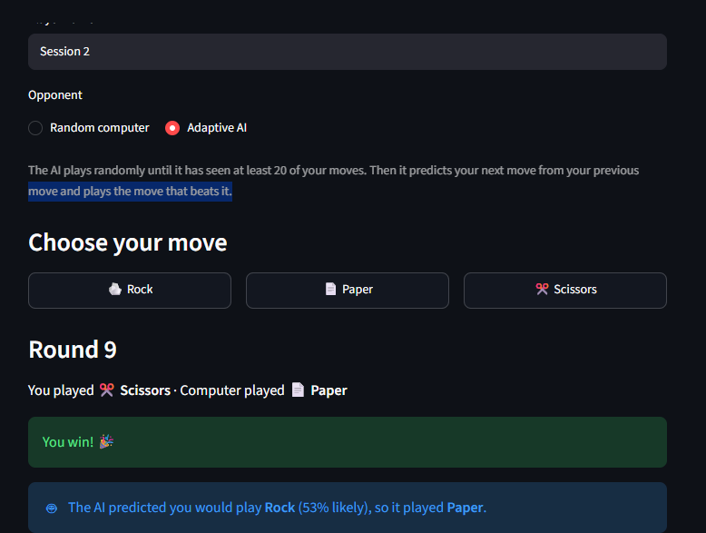
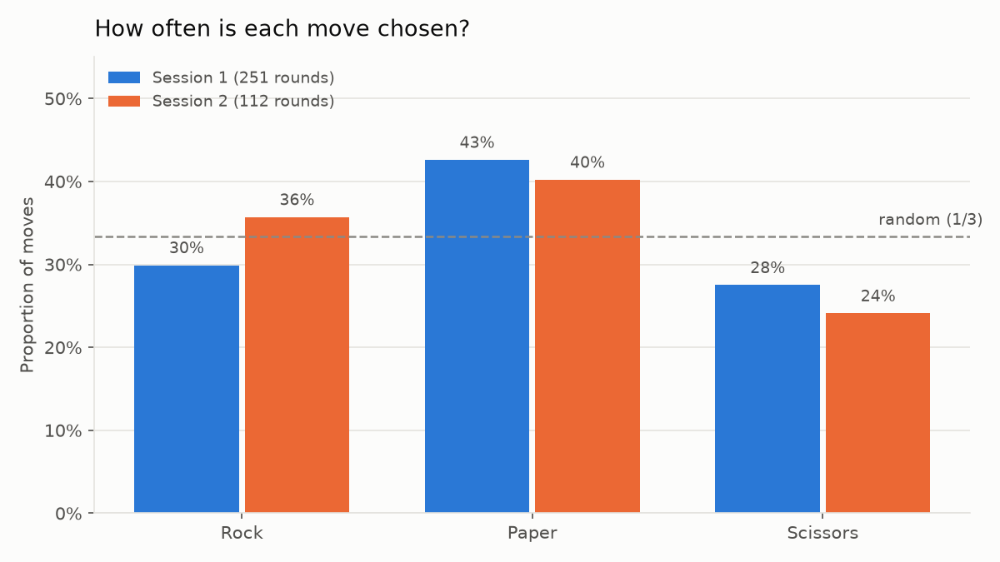
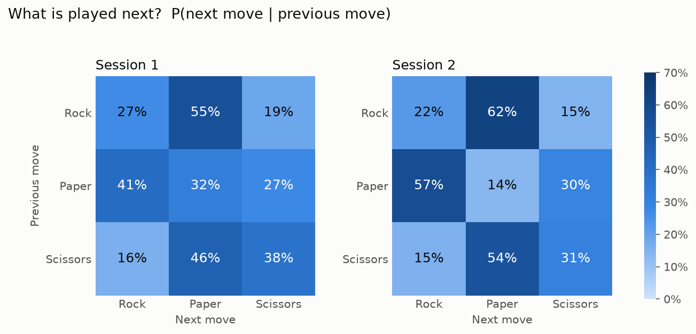
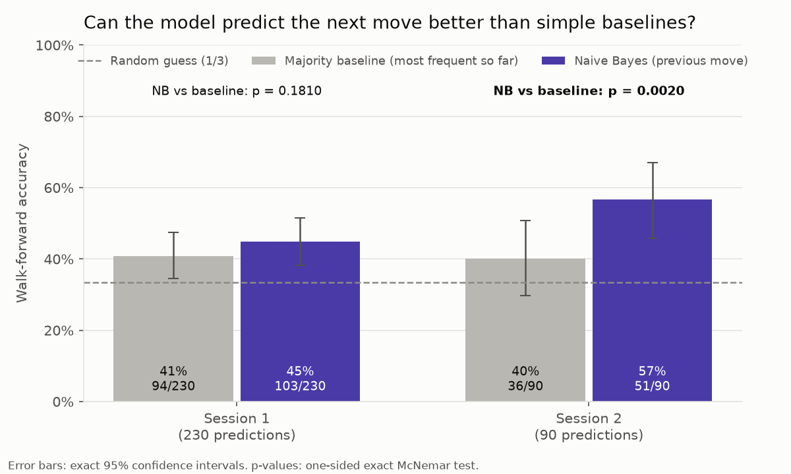
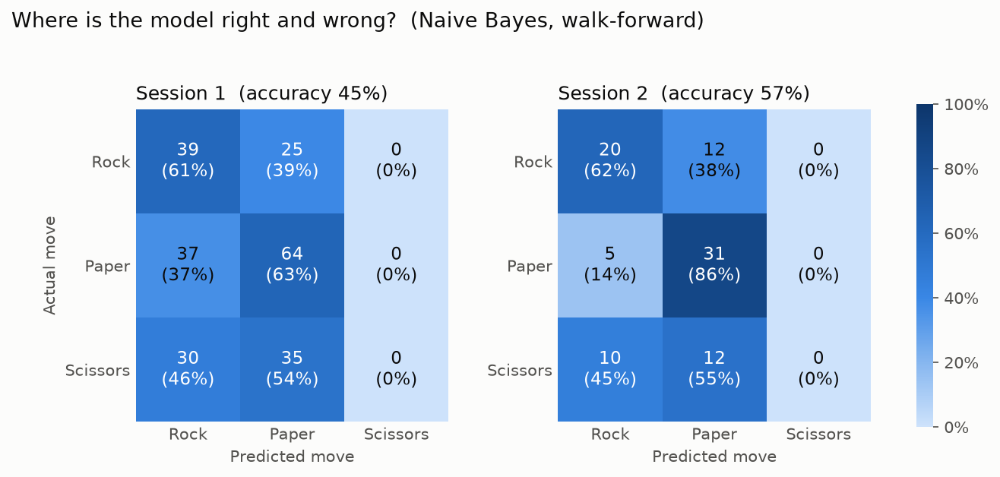

# 🎮 MindPlay AI — Adaptive Rock-Paper-Scissors

An interactive Rock-Paper-Scissors game that collects gameplay data, uses **statistical tests** to check whether a player's moves are random, and trains a simple, explainable **machine-learning model** to predict the next move and play the counter-move.



---

## Research question

> **Can statistical pattern analysis and machine learning be used to predict a player's next move in Rock-Paper-Scissors?**

A perfectly random player cannot be predicted: every move would be chosen 1/3 of the time, independently of earlier moves. So the question has two parts:

1. **Statistics:** Is the player's behaviour random?
2. **Machine learning:** If not, can a model predict *future* moves better than simple baselines?

---

## Key findings

The data are **360 rounds from one player (the author) in two sessions**, all played against a computer that chose moves uniformly at random.

| Question | Session 1 (251 rounds) | Session 2 (109 rounds) |
|---|---|---|
| Are all moves chosen equally often? *(chi-square goodness-of-fit)* | **No**: Paper 43% (p = 0.0068) | Not significant (p = 0.093) |
| Does the next move depend on the previous move? *(chi-square independence)* | **Yes** (p = 0.0007) | **Yes** (p < 0.0001) |
| Win-stay / lose-shift? *(chi-square)* | No evidence (p = 0.94) | No evidence (p = 0.53) |
| Model accuracy on unseen moves *(walk-forward)* | 44.8% (103/230) | **56.8% (50/88)** |
| Better than random guessing (33%)? *(binomial test)* | **Yes** (p = 0.0002) | **Yes** (p < 0.0001) |
| Better than "always the most frequent move"? *(McNemar test)* | No (40.9% vs 44.8%, p = 0.18) | **Yes** (39.8% vs 56.8%, p = 0.002) |

**In short:**
- The moves were **not random**. The strongest and most consistent pattern was **sequential**: Rock → Paper and Paper → Rock, in **both sessions**.
- In Session 2 the model predicted **57%** of moves it had never seen, significantly better than both random guessing and the most-frequent-move baseline. As a counter-strategy, the AI would have won 57% and lost 24% of those rounds.
- In Session 1 the model beat random guessing but **not** the simpler baseline: most of that session's predictability came from a preference for Paper.

---

## Charts

| | |
|---|---|
|  |  |
|  |  |

---

## How it works

**Problem → Data collection → Exploration → Statistical analysis → Feature creation → ML model → Evaluation → Interpretation**

1. **Game and data collection** (`app.py`, `game_logic.py`): every round is saved to `data/rounds.csv` (player, game, round, player move, computer move, result, opponent type).
2. **Statistics** (`stats.py`): data validation, move proportions, transition matrix P(next | previous), and three chi-square tests.
3. **Feature engineering** (`stats.py`): previous player move, previous computer move and previous result, created with `shift()` inside each game.
4. **Machine learning** (`model.py`): a Decision Tree and Naive Bayes were compared on two feature sets. The final model is **Naive Bayes using only the previous move**: the simplest model with the best results, and it outputs probabilities. Adding the previous result made Naive Bayes *worse*, because that feature is fully determined by the other two and breaks the model's independence assumption.
5. **Evaluation** (`evaluate.py`): **walk-forward evaluation** trains on all earlier rounds and predicts the next one, exactly as the AI works in the game, and never uses future data. Results are compared with random guessing and a majority baseline using binomial and exact McNemar tests, plus a confusion matrix and 95% confidence intervals.
6. **Visualisation** (`visualize.py`): the four charts above.
7. **App** (`app.py`, `ai.py`): three tabs:
   - **🎮 Game** against a random computer or the **adaptive AI**, which explains every decision
   - **📊 Player statistics** with plain-language test results
   - **🤖 AI / ML** with the model's decision table and evaluation

The adaptive AI decides using **past rounds only**. It never sees the move the player is making.

---

## Limitations (please read)

- **One player.** Both sessions were played by the author, so the results describe one person, not people in general.
- **Fast clicking and button layout.** Session 1's 251 rounds appear to have been played in about 3 minutes (≈ 0.7 s per round). Rock and Paper are neighbouring buttons, so the Rock ↔ Paper pattern may partly reflect mouse movement rather than a mental strategy.
- **Small samples.** 88 and 230 test predictions give wide confidence intervals (Session 2: 46%–67%).
- **Recorded vs live play.** The evaluation simulates the AI on games against a random computer. A real player may change their behaviour once they notice the AI adapting.
- **The model never predicts Scissors,** because Scissors was never the most likely next move.
- **Several tests on the same data (10 in total).** With a Bonferroni correction (α = 0.05 / 10 = 0.005), the sequential pattern in both sessions and all Session 2 model results stay significant; Session 1's Paper preference (p = 0.0068) does not.

---

## Run it yourself

Tested with Python 3.14 on Windows.

```bash
git clone https://github.com/nipun638/mindplay-ai.git
cd mindplay-ai
python -m venv .venv
.venv\Scripts\Activate.ps1          # Windows PowerShell
# source .venv/bin/activate          # macOS / Linux
python -m pip install -r requirements.txt

streamlit run app.py                # the app
python stats.py                     # statistical analysis
python model.py                     # model comparison (single time-based split)
python evaluate.py                  # walk-forward evaluation and tests
python visualize.py                 # re-create the charts in images/
```

---

## Project structure

| File | Purpose |
|---|---|
| `app.py` | Streamlit app: game, statistics tab, AI / ML tab |
| `game_logic.py` | Game rules (moves, winner) |
| `ai.py` | Adaptive AI: predict the next move and play the counter-move |
| `stats.py` | Data loading, validation, descriptive statistics, chi-square tests |
| `model.py` | Feature encoding, time-based split, Decision Tree and Naive Bayes |
| `evaluate.py` | Walk-forward evaluation, binomial and McNemar tests, confusion matrix |
| `visualize.py` | Charts saved to `images/` |
| `clean_data.py` | One-time data cleaning (removed test rounds, relabelled sessions) |
| `play_terminal.py` | First terminal prototype of the game |
| `data/rounds.csv` | The dataset |
| `PROJECT_LOG.md` | Step-by-step development log, including problems, fixes and decisions |

---

## Future work

- Collect data from several different players.
- Randomise the button order to test whether the Rock ↔ Paper pattern comes from the layout.
- Measure whether players adapt when they face the adaptive AI.
- Choose the AI's move by expected score from the predicted probabilities instead of only countering the most likely move.

---

## Tech stack

Python · Streamlit · pandas · NumPy · SciPy · scikit-learn · matplotlib

**Author:** [nipun638](https://github.com/nipun638)
